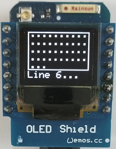

# D1 mini - Demo: Verschiedene Textbildschirme f&uuml;r OLED
Sketch: D1_oop02_oled_testall_V2.ino, Version 2017-12-17   
[English version](./README.md "English version")   

Dieses Beispielprogramm zeigt verschiedene Bildschirm-Layouts unter Verwendung der Klasse __DisplayKH__ .   
Die Klasse __DisplayKH__ erweitert die Klassen Adafruit_SSD1306 und Adafruit_GFX (und Klasse Print), sodass auch alle Methoden dieser Klassen verwendet werden k&ouml;nnen.
Gibt es Anzeige-Probleme mit der Adafruit_SSD1306 Bibliotek, so kann man die Dateien aus dem Verzeichnis `./libs` einfach in dieses Arbeitsverzeichnis kopieren.

Ein zus&auml;tzlicher 5x8 pixel Zeichensatz (fontKH_5x8Bitmaps) befindet sich in der Datei `D1_class_DisplayKH.h`. Die Darstellung jedes einzelnen Zeichens kann mit der OpenOffice Calc Datei `myfont5x8.ods` (befindet sich im Unterverzeichnis `fonteditor`) ver&auml;ndert werden.

**Die 6 Adafruit-Dateien im Unterverzeichnis `/libs`:**   
Adafruit_GFX.cpp (32.436 Bytes)   
Adafruit_GFX.h (4.944 Bytes)   
Adafruit_SSD1306.cpp (27.813 Bytes)   
Adafruit_SSD1306.h (5.806 Bytes)   
gfxfont.h (924 Bytes)   
glcdfont.c (8.486 Bytes)

## Hardware
* WeMos D1 mini
* OLED Shield: SSD1306, 64x48 pixel, I2C

## Bildschirme
### Bildschirmnamen

`screen##iClear`   
 ## ....... Anzahl Textzeilen bei diesem Bildschirm (6, 5, 4, 3, 2 oder Kombinationen 221, 112, 13 12)   
 i .......... eine Zeile ist invertiert (schwarzer Text auf wei&szlig;em Hintergrund)   
 Clear ... Bildschirm l&ouml;schen vor dem Schreiben der Zeile   

_Beispiele_
* screen4 ..... 4 Zeilen, normale Zeichendarstellung (wei&szlig; auf schwarz), Rand rundherum
* screen4i .... 4 Zeilen, normale Zeichendarstellung (wei&szlig; auf schwarz), 1. Zeile invertiert
* screen4ii ... 4 Zeilen, normale Zeichendarstellung (wei&szlig; auf schwarz), 1. und 3. Zeile invertiert
* screen13 .... 1 Zeile mit doppelt gro&szlig;en Zeichen, 3 Zeilen mit normaler Zeichendarstellung

Parameter
* line_ .... Zeilennummer, in die der Text geschrieben wird (1 bis 6 = Zeile 6)
* text_ .... Text, der geschrieben werden soll (max. 10 Zeichen pro Zeile, 5 Zeichen bei doppelt gro&szlig;en Zeichen)
* align_ ... Textausrichtung (Vorgabe: 'l'=linksb&uuml;ndig. 'c'=zentriert, 'r'=rechtsb&uuml;ndig, 'L'=linksb&uuml;ndig+Zeichen &uuml;berschreiben, C'=zentriert+Zeichen &uuml;berschreiben, 'R'=rechtsb&uuml;ndig+Zeichen &uuml;berschreiben)

**Bildschirme (Screens) mit einfach hohen Zeilen (Zeichen)**   

   

   
**Bildschirme (Screens) mit einfach und doppelt hohen Zeilen**   

   
**Bildschirme (Screens) mit doppelt hohen Zeilen, Spezialbildschirme**   

## Klassendiagramm DisplayKH

| Klasse DisplayKH               | erweitert Adafruit_SSD1306, Adafruit_GFX, Print      |
| ------------------------------ | ---------------------------------------------------- |
| + DisplayKH()                  | Vorgabekonstruktor, setzt OLED_RESET auf D3(=GPIO0), ruft setup() auf |
| + DisplayKH(int oled_resetpin) | Konstruktor, setzt OLED reset Pin, ruft setup() auf |
| ~ void setup(int pin_num)      | Eigenschaften setzen (I2C Adresse, Zeichensatz (font), Textfarbe, Textgr&ouml;&szlig;e, dotCounter)            |
| ===== *Bildschirme mit nur einfach hohen Zeilen* =====      |                                                       |
| + void screen6 (int line_, String text_)                    | Schreibe Text in Zeile 1...6, Text linksb&uuml;ndig, kein Rahmen  |
| + void screen6 (int line_, String text_, char align_)       | Schreibe Text in Zeile 1...6, angegebene Textausrichtung, kein Rahmen |
| + void screen6Clear (int line_, String text_, char align_)  | clear screen, Schreibe Text in Zeile 1...6, angegebene Textausrichtung, kein Rahmen |
| 
 | 
 |
| + void screen6i(int line_, String text_)    | Schreibe Text in Zeile 1...6 (line 1 inverted), Text linksb&uuml;ndig, kein Rahmen  |
| + void screen6i(int line_, String text_, char align_)       | Schreibe Text in Zeile 1...6 (line 1 inverted), angegebene Textausrichtung, kein Rahmen |
| + void screen6iClear(int line_, String text_, char align_)  | clear screen, Schreibe Text in Zeile 1...6 (line 1 inverted), angegebene Textausrichtung, kein Rahmen |
| 
 | 
 |
| + void screen5 (int line_, String text_)                    | Schreibe Text in Zeile 1...5, Text linksb&uuml;ndig, Rahmen  |
| + void screen5 (int line_, String text_, char align_)       | Schreibe Text in Zeile 1...5, angegebene Textausrichtung, Rahmen |
| + void screen5Clear(int line_, String text_, char align_)   | Bildschirm l&ouml;schen, Schreibe Text in Zeile 1...5, angegebene Textausrichtung, Rahmen |
| 
 | 
 |
| + void screen5i(int line_, String text_)                         | Schreibe Text in Zeile 1...5 (Zeile 1 invertiert), Text linksb&uuml;ndig, Rahmen  |
| + void screen5i(int line_, String text_, char align_)            | Schreibe Text in Zeile 1...5 (Zeile 1 invertiert), angegebene Textausrichtung, Rahmen |
| + void screen5iClear(int line_, String text_, char align_)       | Bildschirm l&ouml;schen, Schreibe Text in Zeile 1...5 (Zeile 1 invertiert), angegebene Textausrichtung, Rahmen |
| 
 | 
 |
| + void screen221(int line_,String text_, char align_, bool cls_) | Schreibe Text in Zeile 1...5, angegebene Textausrichtung, Rahmen 1+2 und 3+4, Bildschirm l&ouml;schen |
| + void screen221(int line_,String text_)                         | Schreibe Text in Zeile 1...5, Text linksb&uuml;ndig,  Rahmen um Zeile 1+2 und 3+4 |
| + void screen221(int line_,String text_, char align_)            | Schreibe Text in Zeile 1...5, angegebene Textausrichtung, Rahmen um Zeile 1+2 und 3+4 |
| + void screen221Clear(int line_,String text_, char align_)       | Bildschirm l&ouml;schen, Schreibe Text in Zeile 1...5, angegebene Textausrichtung, Rahmen um Zeile 1+2 und 3+4 |
| 
 | 
 |
| + void screen4 (int line_, String text_)                         | Schreibe Text in Zeile 1...4, Text linksb&uuml;ndig, Rahmen  |
| + void screen4 (int line_, String text_, char align_)            | Schreibe Text in Zeile 1...4, angegebene Textausrichtung, Rahmen |
| + void screen4Clear (int line_, String text_, char align_)       | Bildschirm l&ouml;schen, Schreibe Text in Zeile 1...4, angegebene Textausrichtung, Rahmen |
| 
 | 
 |
| + void screen4i(int line_, String text_)                         | Schreibe Text in Zeile 1...4 (Zeile 1 invertiert), Text linksb&uuml;ndig, Rahmen  |
| + void screen4i(int line_, String text_, char align_)            | Schreibe Text in Zeile 1...4 (Zeile 1 invertiert), angegebene Textausrichtung, Rahmen |
| + void screen4iClear(int line_, String text_, char align_)       | Bildschirm l&ouml;schen, Schreibe Text in Zeile 1...4 (Zeile 1 invertiert), angegebene Textausrichtung, Rahmen |
| 
 | 
 |
| + void screen4ii(int line_,String text_, char align_, bool cls_) | Schreibe Text in Zeile 1...4 (Zeile 1+3 invertiert), angegebene Textausrichtung, Rahmen, Bildschirm l&ouml;schen |
| + void screen4ii(int line_,String text_)                         | Schreibe Text in Zeile 1...4 (Zeile 1+3 invertiert), Text linksb&uuml;ndig, Rahmen  |
| + void screen4ii(int line_,String text_, char align_)            | Schreibe Text in Zeile 1...4 (Zeile 1+3 invertiert), angegebene Textausrichtung, Rahmen |
| + void screen4iiClear(int line_,String text_, char align_)       | Bildschirm l&ouml;schen, Schreibe Text in Zeile 1...4 (Zeile 1+3 invertiert), angegebene Textausrichtung, Rahmen |

&nbsp;

| Bildschirme mit einfach und doppelt hohen Zeilen |                  |
| ------------------------------------------------ | ---------------- |
| + void screen112(int line_,String text_, char align_, bool cls_) | Schreibe Text in Zeile 1...4 (Zeile 1 invertiert, line 2 big), Text linksb&uuml;ndig, Rahmen, Bildschirm l&ouml;schen |
| + void screen112(int line_,String text_)                         | Schreibe Text in Zeile 1...4 (Zeile 1 invertiert, line 2 big), Text linksb&uuml;ndig, Rahmen  |
| + void screen112(int line_,String text_, char align_)            | Schreibe Text in Zeile 1...4 (Zeile 1 invertiert, line 2 big), angegebene Textausrichtung, Rahmen  |
| + void screen112Clear(int line_,String text_, char align_)       | Bildschirm l&ouml;schen, Schreibe Text in Zeile 1...4 (Zeile 1 invertiert, line 2 big), angegebene Textausrichtung, Rahmen  |
| 
 | 
 | 
| + void screen13(int line_, String text_, char align_, bool cls_) | Schreibe Text in Zeile 1...4 (Zeile 1 doppelt hoch, Rahmen), angegebene Textausrichtung, Bildschirm l&ouml;schen |
| + void screen13(int line_, String text_)                         | Schreibe Text in Zeile 1...4 (Zeile 1 doppelt hoch, Rahmen), Text linksb&uuml;ndig  |
| + void screen13(int line_, String text_, char align_)            | Schreibe Text in Zeile 1...4 (Zeile 1 doppelt hoch, Rahmen), angegebene Textausrichtung |
| + void screen13Clear(int line_, String text_, char align_)       | Bildschirm l&ouml;schen, Schreibe Text in Zeile 1...4 (Zeile 1 doppelt hoch, Rahmen), angegebene Textausrichtung |
| 
 | 
 |
| + void screen12(int line_, String text_, char align_, bool cls_) | Schreibe Text in Zeile 1...3 (Zeile 1 doppelt hoch, Rahmen), angegebene Textausrichtung, Bildschirm l&ouml;schen |
| + void screen12(int line_, String text_)                         | Schreibe Text in Zeile 1...3 (Zeile 1 doppelt hoch, Rahmen), Text linksb&uuml;ndig  |
| + void screen12(int line_, String text_, char align_)            | Schreibe Text in Zeile 1...3 (Zeile 1 doppelt hoch, Rahmen), angegebene Textausrichtung |
| + void screen12Clear(int line_, String text_, char align_)       | Bildschirm l&ouml;schen, Schreibe Text in Zeile 1...3 (Zeile 1 doppelt hoch, Rahmen), angegebene Textausrichtung |
| 
 | 
 |
| + void screen2 (int line_, String text_, char align_, bool cls_) | Schreibe Text in Zeile 1...2 (big, Rahmen), angegebene Textausrichtung, Bildschirm l&ouml;schen |
| + void screen2 (int line_, String text_)                         | Schreibe Text in Zeile 1...2 (big, Rahmen), Text linksb&uuml;ndig  |
| + void screen2 (int line_, String text_, char align_)            | Schreibe Text in Zeile 1...2 (big, Rahmen), angegebene Textausrichtung |
| + void screen2Clear(int line_, String text_, char align_)        | Bildschirm l&ouml;schen, Schreibe Text in Zeile 1...2 (big, Rahmen), angegebene Textausrichtung |

&nbsp;

| Spezial-Bildschirme            |                  |
| ------------------------------ | ---------------- |
| + void dotClear(void)          | Bildschirm l&ouml;schen, zeichne Rahmen                           |
| + void dotClear(String line6)  | Bildschirm l&ouml;schen, zeichne Rahmen, Schreibe Text in Zeile 6 |
| + void dot(void)               | zeichne einen Punkt, erh&ouml;he dotCounter                       |
| + void dotLine(String line6)   | schreibe Text in Zeile 6                                          |
| ===== *Hilfsfunktionen* =====  |                                           |
| ~ String mytrim(int max_, String txt_, char align)                         | Erstelle einen String mit max Zeichen (erg&auml;nze Leerzeichen davor und danach) |
| ~ void scr6(int line_, String text_, char align_, bool cls_, bool invert_) | Display: 1 Bereich, 6 Zeilen, 10 Zeichen pro Zeile, kein Rahmen |
| ~ void scr5(int line_, String text_, char align_, bool cls_, bool invert_) | Display: 1 Bereich, 5 Zeilen, 10 Zeichen pro Zeile, kein Rahmen |
| ~ void scr4(int line_, String text_, char align_, bool cls_, bool invert_) | Display: 1 Bereich, 4 Zeilen, 10 Zeichen pro Zeile, kein Rahmen |

&nbsp;

|  *Eigenschaften*      |                                  |
| --------------------- | -------------------------------- |
| ~ int dotCounter      | counter for dot screen (0...50)  |
