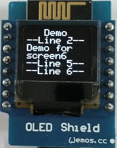
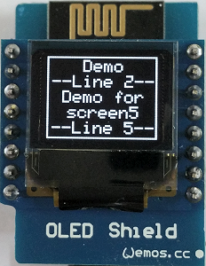
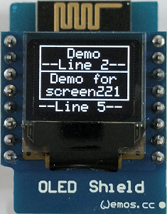
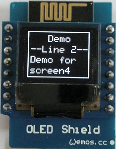
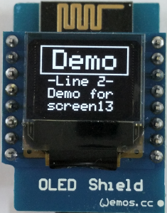

# D1 mini - Demo: Show different text screens on OLED
Sketch: D1_oop02_oled_testall_V2.ino, Version 2017-12-17   
[Deutsche Version](./LIESMICH.md "Deutsche Version")   

This example shows writing text on different screens on OLED shield using the class __DisplayKH__ .   
The class __DisplayKH__  extends the classes Adafruit_SSD1306 and Adafruit_GFX (and class Print), so you can use all commands from these classes as well.
If you have problems with the Adafruit_SSD1306 lib you can use the files located in the directory `./libs`. Copy the files from subfolder `./libs` to this working directory.

A additional 5x8 pixel font (fontKH_5x8Bitmaps) is located in file `D1_class_DisplayKH.h`. You can modify every character by using the OpenOffice Calc file `myfont5x8.ods` from subfolder `fonteditor`.

**The 6 Adafruit-files in subdirectory `/libs`:**   
Adafruit_GFX.cpp (32.436 Bytes)   
Adafruit_GFX.h (4.944 Bytes)   
Adafruit_SSD1306.cpp (27.813 Bytes)   
Adafruit_SSD1306.h (5.806 Bytes)   
gfxfont.h (924 Bytes)   
glcdfont.c (8.486 Bytes)

## Hardware
* WeMos D1 mini
* OLED Shield: SSD1306, 64x48 pixel, I2C

## Screens
### screen names

`screen##iClear`   
 ## ....... number of lines (6, 5, 4, 3, 2 or combinations 221, 112, 13 12)   
 i .......... one line is inverted (black text with white background)   
 Clear ... clear screen before writing text   

_examples_
* screen4 ..... 4 lines with normal chars and border around
* screen4i .... 4 lines with normal chars, line 1 inverted
* screen4ii ... 4 lines with normal chars, line 1 and 3 inverted
* screen13 .... 1 line with big chars, 3 lines with normal chars

Parameters
* line_ .... write text to this line number on oled (1 to 6 = line 6)
* text_ .... text to write (max. 10 chars or 5 big chars)
* align_ ... align of text (default: 'l'=left. 'c'=center, 'r'=right, 'L'=left+overwrite, C'=center+overwrite, 'R'=right+overwrite)

**Screens with only single size lines**   

   

   
**Screens with single and double size lines**   

   
**Screens with two double size lines, special screens**   

## Class diagram DisplayKH

| class DisplayKH                | extends Adafruit_SSD1306, Adafruit_GFX, Print        |
| ------------------------------ | ---------------------------------------------------- |
| + DisplayKH()                  | default constructor, set OLED_RESET to D3(=GPIO0), call setup() |
| + DisplayKH(int oled_resetpin) | constructor, set OLED reset pin, call setup() |
| ~ void setup(int pin_num)      | setup properties (I2C address, font, text color, text size, dotCounter)            |
| ===== *screens with only single size lines* =====           |                                                       |
| + void screen6 (int line_, String text_)                    | write text to line 1...6, text align left, no border  |
| + void screen6 (int line_, String text_, char align_)       | write text to line 1...6, given text align, no border |
| + void screen6Clear (int line_, String text_, char align_)  | clear screen, write text to line 1...6, given text align, no border |
| 
 | 
 |
| + void screen6i(int line_, String text_)    | write text to line 1...6 (line 1 inverted), text align left, no border  |
| + void screen6i(int line_, String text_, char align_)       | write text to line 1...6 (line 1 inverted), given text align, no border |
| + void screen6iClear(int line_, String text_, char align_)  | clear screen, write text to line 1...6 (line 1 inverted), given text align, no border |
| 
 | 
 |
| + void screen5 (int line_, String text_)                    | write text to line 1...5, text align left, border  |
| + void screen5 (int line_, String text_, char align_)       | write text to line 1...5, given text align, border |
| + void screen5Clear(int line_, String text_, char align_)   | clear screen, write text to line 1...5, given text align, border |
| 
 | 
 |
| + void screen5i(int line_, String text_)                         | write text to line 1...5 (line 1 inverted), text align left, border  |
| + void screen5i(int line_, String text_, char align_)            | write text to line 1...5 (line 1 inverted), given text align, border |
| + void screen5iClear(int line_, String text_, char align_)       | clear screen, write text to line 1...5 (line 1 inverted), given text align, border |
| 
 | 
 |
| + void screen221(int line_,String text_, char align_, bool cls_) | write text to line 1...5, given text align, border 1+2 and 3+4, clear screen |
| + void screen221(int line_,String text_)                         | write text to line 1...5, text align left,  border 1+2 and 3+4 |
| + void screen221(int line_,String text_, char align_)            | write text to line 1...5, given text align, border 1+2 and 3+4 |
| + void screen221Clear(int line_,String text_, char align_)       | clear screen, write text to line 1...5, given text align, border 1+2 and 3+4 |
| 
 | 
 |
| + void screen4 (int line_, String text_)                         | write text to line 1...4, text align left, border  |
| + void screen4 (int line_, String text_, char align_)            | write text to line 1...4, given text align, border |
| + void screen4Clear (int line_, String text_, char align_)       | clear screen, write text to line 1...4, given text align, border |
| 
 | 
 |
| + void screen4i(int line_, String text_)                         | write text to line 1...4 (line 1 inverted), text align left, border  |
| + void screen4i(int line_, String text_, char align_)            | write text to line 1...4 (line 1 inverted), given text align, border |
| + void screen4iClear(int line_, String text_, char align_)       | clear screen, write text to line 1...4 (line 1 inverted), given text align, border |
| 
 | 
 |
| + void screen4ii(int line_,String text_, char align_, bool cls_) | write text to line 1...4 (line 1+3 inverted), given text align, border, clear screen |
| + void screen4ii(int line_,String text_)                         | write text to line 1...4 (line 1+3 inverted), text align left, border  |
| + void screen4ii(int line_,String text_, char align_)            | write text to line 1...4 (line 1+3 inverted), given text align, border |
| + void screen4iiClear(int line_,String text_, char align_)       | clear screen, write text to line 1...4 (line 1+3 inverted), given text align, border |

&nbsp;

| screens with single and double size lines     |                  |
| --------------------------------------------- | ---------------- |
| + void screen112(int line_,String text_, char align_, bool cls_) | write text to line 1...4 (line 1 inverted, line 2 big), text align left, border, clear screen |
| + void screen112(int line_,String text_)                         | write text to line 1...4 (line 1 inverted, line 2 big), text align left, border  |
| + void screen112(int line_,String text_, char align_)            | write text to line 1...4 (line 1 inverted, line 2 big), given text align, border  |
| + void screen112Clear(int line_,String text_, char align_)       | clear screen, write text to line 1...4 (line 1 inverted, line 2 big), given text align, border  |
| 
 | 
 | 
| + void screen13(int line_, String text_, char align_, bool cls_) | write text to line 1...4 (line 1 big, border), given text align, clear screen |
| + void screen13(int line_, String text_)                         | write text to line 1...4 (line 1 big, border), text align left  |
| + void screen13(int line_, String text_, char align_)            | write text to line 1...4 (line 1 big, border), given text align |
| + void screen13Clear(int line_, String text_, char align_)       | clear screen, write text to line 1...4 (line 1 big, border), given text align |
| 
 | 
 |
| + void screen12(int line_, String text_, char align_, bool cls_) | write text to line 1...3 (line 1 big, border), given text align, clear screen |
| + void screen12(int line_, String text_)                         | write text to line 1...3 (line 1 big, border), text align left  |
| + void screen12(int line_, String text_, char align_)            | write text to line 1...3 (line 1 big, border), given text align |
| + void screen12Clear(int line_, String text_, char align_)       | clear screen, write text to line 1...3 (line 1 big, border), given text align |
| 
 | 
 |
| + void screen2 (int line_, String text_, char align_, bool cls_) | write text to line 1...2 (big, border), given text align, clear screen |
| + void screen2 (int line_, String text_)                         | write text to line 1...2 (big, border), text align left  |
| + void screen2 (int line_, String text_, char align_)            | write text to line 1...2 (big, border), given text align |
| + void screen2Clear(int line_, String text_, char align_)        | clear screen, write text to line 1...2 (big, border), given text align |

&nbsp;

| special screens                |                  |
| ------------------------------ | ---------------- |
| + void dotClear(void)          | clear screen, draw border                       |
| + void dotClear(String line6)  | clear screen, draw border, write text to line 6 |
| + void dot(void)               | draw a dot, increment dotCounter                |
| + void dotLine(String line6)   | write text to line 6                            |
| ===== *helper functions* ===== |                                           |
| ~ String mytrim(int max_, String txt_, char align)                         | build a string with max chars (add blank before/after) |
| ~ void scr6(int line_, String text_, char align_, bool cls_, bool invert_) | display: 1 area, 6 lines, 10 chars/line, no border |
| ~ void scr5(int line_, String text_, char align_, bool cls_, bool invert_) | display: 1 area, 5 lines, 10 chars/line, no border |
| ~ void scr4(int line_, String text_, char align_, bool cls_, bool invert_) | display: 1 area, 4 lines, 10 chars/line, no border |

&nbsp;

|  *properties*         |                                  |
| --------------------- | -------------------------------- |
| ~ int dotCounter      | counter for dot screen (0...50)  |
