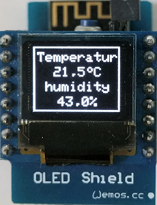

# D1_oop03_oled_screen4 
This example shows writing text on a OLED shield using the easy to use class __DisplayKH__ for displaying text (12 different "screens"). On the display you see a
* "temperature" 20,0 to 40,0&deg;C (increased by 0,1 &deg; every second) and
* "humidity"    double value of temperature

The class DisplayKH extends class Adafruit_SSD1306, so you can use all commands from this class as well.
Additionally a 5x8 pixel font is included in DisplayKH.
The Adafruit-files in /libs are out of the libs
* Adafruit_SSD1306-esp8266-64x48.zip and
* Adafruit-GFX-Library-1.1.5.zip

When using the Adafruit libs, delete the directory /libs !

| files in /libs       | Size         |
| -------------------- | ------------ |
| Adafruit_GFX.cpp     | 32.436 Bytes |
| Adafruit_GFX.h       |  4.944 Bytes |
| Adafruit_SSD1306.cpp | 27.813 Bytes |
| Adafruit_SSD1306.h   |  5.806 Bytes |
| gfxfont.h            |    924 Bytes |
| glcdfont.c           |  8.486 Bytes |

## Hardware
* WeMos D1 mini
* OLED Shield: SSD1306, 64x48 pixel, I2C (SCL GPIO5, SDA GPIO4, OLED_RESET GPIO0)

## Class diagram
Parameters
* line_ .... line on the oled (1 to max. line 6)
* text_ .... text to write (max. 10 chars or 5 big chars)
* align_ ... align of text (default: 'l'=left. 'c'=center, 'r'=right, 'L'=left+overwrite, 'C'=center+overwrite, 'R'=right+overwrite)
* cls_ ..... clear display (default: false = do not clear display)

screen names (examples)
* screen4 ..... 4 lines with normal chars and border arround
* screen4i .... 4 lines with normal chars, line 1 inverted
* screen4ii ... 4 lines with normal chars, line 1 and 3 inverted

| class DisplayKH (extends Adafruit_SSD1306) |
| ------------------------------------------ |
| + DisplayKH()   + void screen6 (int line_, String text_, char align_, bool cls_)   + void screen6i(int line_, String text_, char align_, bool cls_)   + void screen5 (int line_, String text_, char align_, bool cls_)   + void screen5i(int line_, String text_, char align_, bool cls_)   +  void screen4 (int line_, String text_, char align_, bool cls_)   + void screen4i(int line_, String text_, char align_, bool cls_)   + void screen4ii(int line_, String text_, char align_, bool cls_)   + void screen221(int line_, String text_, char align_, bool cls_) |
| _screens with big character-lines_ |
| + void screen112(int line_, String text_, char align_, bool cls_)   + void screen13(int line_, String text_, char align_, bool cls_)   + void screen12(int line_, String text_, char align_, bool cls_)   + void screen2 (int line_, String text_, char align_, bool cls_) |
| - String mytrim(int max_, String txt_, char align)   - void scr6(int line_, String text_, char align_, bool cls_, bool invert_)   - void scr5(int line_, String text_, char align_, bool cls_, bool invert_)   - void scr4(int line_, String text_, char align_, bool cls_, bool invert_) |
